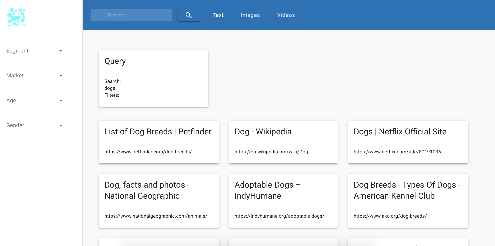
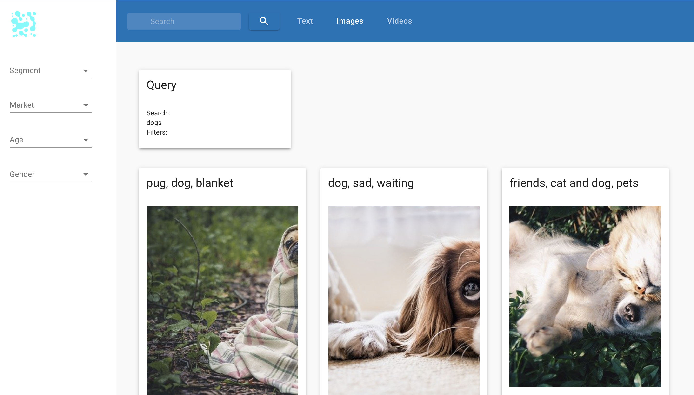
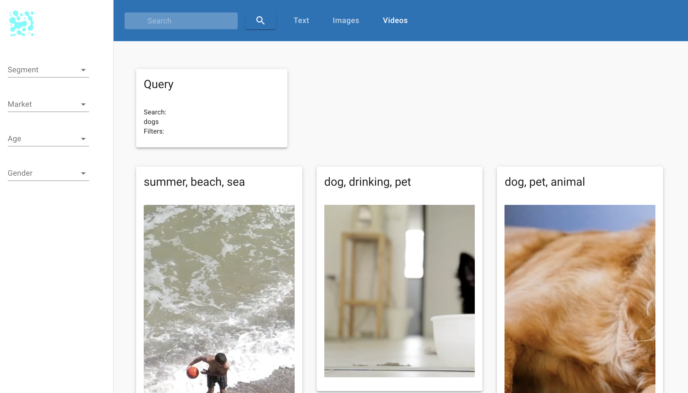

# Search Anything

> An API to search for almost everything

## How

To get this up'n running in an orderly manner, please run your prefered package-manager to install the dependencies using the install command, then run the `start`-script. This will spin up an instance of the dev server on port `3000`.

Guide on how to run on using `npm`and/or `pnpm`.

- `npm`
  - `npm install`
  - `npm start`

## Using the following APIs

- [Serpstack - Free Google Search API](https://serpstack.com/)
- [Pixabay - Free Images/Videos](https://pixabay.com/)

## Images Of App

## Using the following libraries

- [Experimenting with the Pinterest Masonry Grid](https://www.npmjs.com/package/react-masonry-css)

### Dependenciesx

Check [package.json](package.json) for the required dependencies.
